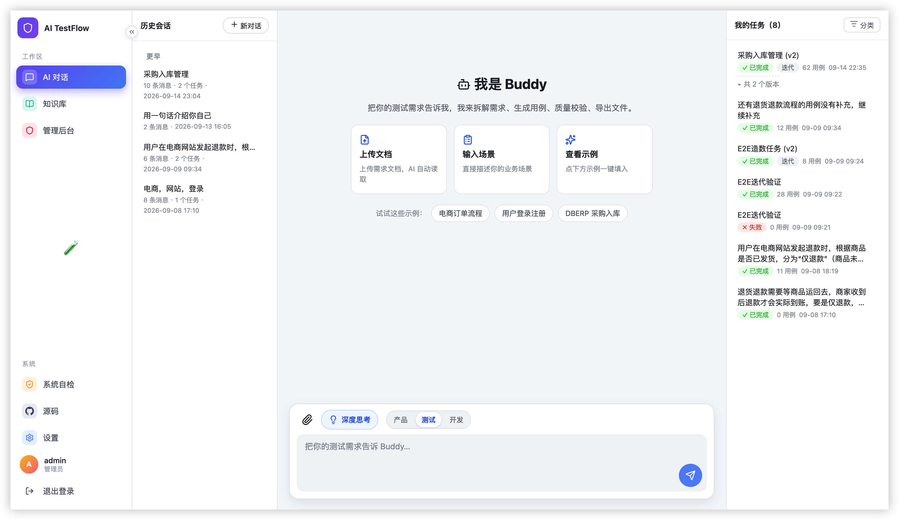
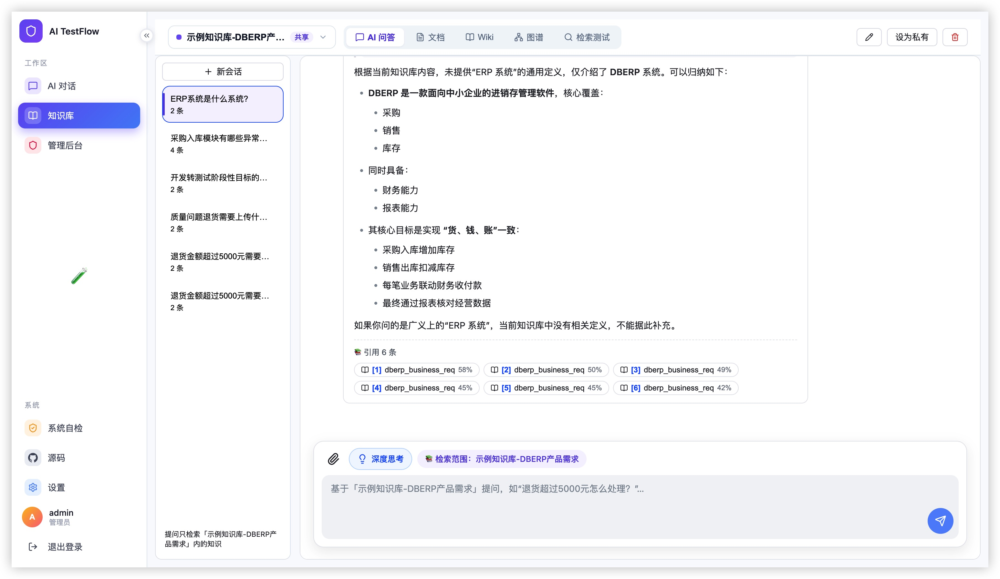
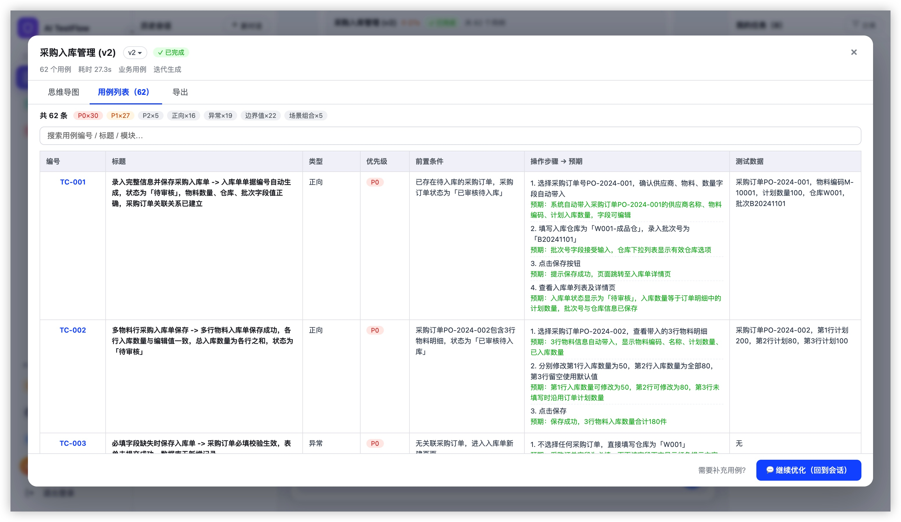
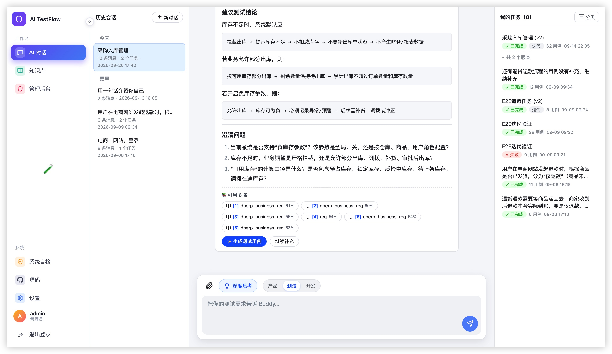

# AI 测试工作流平台

> 作品集「门面担当」全栈产品，当前版本 **V4.5.1**（2026-09-20）。
> 一句话定位：把"规格 → AI 生成测试用例 → 质量校验 → 导出"做成一条**可编排、可观测、可对话驱动的工作流**，配可视化前端；并内置 **RAG 知识库**与**知识库问答**能力——AI 对话默认自动检索私有/共享知识库并给出引用溯源。支持多厂商大模型、**多角色协作视角（产品/测试/开发）**、多级分类、思维导图预览、三级用户体系与流量分级加密，以及任务级用例迭代与多格式导入。

在线演示：[https://ai.clickscope.in](https://ai.clickscope.in)

***

## 它解决什么

真实部署的 **DBERP 进销存系统**（服务器上已部署）没有 Swagger、也没有现成测试用例。
本平台以它为被测对象，把测试用例生成做成平台能力：

- 输入：接口规格（OpenAPI JSON）/ 业务需求（Markdown，支持图片引用）/ 知识库文档（PRD、历史用例、接口定义）

- 输出：结构化测试用例（xlsx / json / xmind）

- 过程：四 Agent 编排，每步可观测、可重试、可定位错误

- 扩展：用户级模型配置、任务分类管理、思维导图在线评审、**RAG 知识库问答**

***



## 功能一览

### 核心工作流

- 四 Agent 编排：Parser → Generator → Reviewer → Exporter

- 任务状态机：pending → running → completed | failed

- 步骤日志：每步状态 / 耗时 / 输出摘要 / 错误详情

- 任务调度底座（V3.2）：全局任务队列 + 5 Worker 池，uvicorn 启动恢复未完成任务（部署不丢任务）；失败任务**断点续跑 + 重试按钮**

### 任务管理

- 任务列表（左右分栏：左分类树 / 右任务卡片）

- 多级分类树：新建（含子分类）/ 重命名 / 删除（子分类级联，任务回落未分类）

- 任务归类：每任务「🏷」菜单一键归入/移出分类，计数实时更新

- 点击分类节点过滤任务列表，实时显示各节点任务数

### 统一入口与会话内迭代（V2.10）

> 产品原则：**主页会话输入框是"发起工作"的唯一入口** —— 新任务、旧任务迭代、用例迭代全部在此发起。

- **详情页零输入表单**：任务详情抽屉只做结果查看（思维导图 / 用例表格 / 步骤时间线）与导出，底部固定「💬 继续优化（回到会话）」为唯一迭代入口

- **迭代引用 chip**：输入框上方显示「🔁 基于《任务名 vN》迭代 ✕」，有 chip = 迭代、无 chip = 新任务；不靠 LLM 猜意图，由用户显式选择

- **先沟通、再生成（V2.10.1）**：挂着 chip 时发消息**只沟通不生成**（走对话流并携带旧任务用例摘要作为上下文），点 chip 上的「⚡ 生成用例」才真正跑 `POST /tasks/{id}/iterate`，补充要求即为累积的沟通内容

- **会话内闭环**：迭代产生的新任务卡以任务卡形式落在会话原位（后端回填 `messages.task_id`），支持「继续优化」，无需先打开详情

- **会话绑定**：`TaskOut` 输出 `conversation_id`，历史任务按 `messages.task_id` 反查兜底，查不到则新建会话绑定

- **多会话并发（V3.2）**：SSE 按会话隔离，多个会话同时聊天互不串流

- **角色化回复身份（V3.2）**：聊天回复按当前角色动态切换语气（qa / pm / dev）

详见 `docs/项目1-统一入口与会话内迭代执行方案-V2.10.md`

### 版本链聚合（V2.11）

- 迭代链（`parent_task_id`）在前端由 `frontend/src/utils/taskChain.ts` 纯函数解析（后端零改动）：回溯链根再收集后代 → v1…vN

- **抽屉版本切换器**：标题行「任务名 → vN ▾」，下拉切换整链任一版本；菜单限高滚动，不再被弹窗裁切；点击外部 / 切换任务自动收起

- **会话流折叠**：同一条链只保留最新一张完整任务卡，旧版本折叠为一行细条

- **任务列表聚合**：同链只占一行，卡片内页脚「▾ 共 N 个版本」展开历史；历史行带左侧竖线缩进 + `[v1]` 版本徽章，视觉上不再与相邻任务混淆

### 导图控件迁入底栏（V2.12）

- 思维导图画布右下角浮动工具栏（导出 XMind / 全屏 / 缩放 / 百分比 / 居中）**迁出画布、与底栏融合成一行**，不再遮挡节点文字

- 左上角「方向切换（左/右/两侧）」保留（`toolBar: false` 会一并关掉，故仅 CSS 隐藏右下角 `.rb`）

- 控件经 React portal 渲染进底栏插槽，全部走 MindElixir 公开 API（`scale(scaleVal ± scaleSensitivity)` / `toCenter()` / `requestFullscreen()`）；滚轮缩放时百分比实时同步，点击百分比一键回 100%

- 底栏右侧「💬 继续优化」保持不变 —— 迭代唯一入口不受影响

### LLM 接入层 LangChain 化（V3）

- LLM 调用层从 HTTP 直连迁移到 **LangChain**：`init_chat_model()` 统一入口 + 全链路统一 `stream()`（收集/逐段两用，打字机协议不变）

- **一个 `model_provider="openai"` 打遍所有厂商**（8 家全 OpenAI 兼容，差异只留 base_url/api_key），不用自己写 if/else

- 厂商自定义参数走 `extra_body` 透传（`enable_thinking` 深度思考开关）；思考字段恢复补丁（ChatOpenAI 默认丢弃 `reasoning_content` 等第三方字段）

- `AITF_LLM_BACKEND=langchain`（默认）/ `httpx`（旧直连）双实现一键回退；**LangSmith 可观测已接入**（`.env` 配 Key 自动打点，每次调用可在 smith.langchain.com 查看 trace）

- 底层同步完成 **SQLAlchemy 2.0 风格迁移**（`db.query` → `db.execute(select)`），与 LangChain 1.x 栈对齐

### 生成用例实时进度（V3）

- 「AI 生成用例」节点运行中实时显示子进度：`正在为第 2/5 个测试点生成用例（下单）· 已生成 18 条`（后端 `StepLog.progress` 逐测试点回调）

- 步骤卡与任务列表状态强同步（列表轮询兜底），不再出现"任务已完成、节点还转圈"

- **步骤卡实时计时器（V3.2）**：任务总耗时 + 单步耗时实时走动，刷新页面不丢（`StepLogOut` 返回 `started_at`）

### 多角色协作（V3.1）

- **三种视角可选**：输入区「深度思考」旁新增 **产品 / 测试 / 开发 多选 pill**（默认仅「测试」，至少选一个）——产品视角关注业务价值/需求覆盖/验收标准，测试视角关注正向/异常/边界/场景组合，开发视角关注契约/幂等/并发/数据一致性

- **角色化提示词模板**：`generator_core/config/prompts/` 新增 api/requirement × pm/dev 4 套角色模板（qa 复用原有模板），同一测试点按「测试点 × 角色」双层循环生成

- **跨角色合并去重**：各角色输出按 标题/模块/用例类型 去重后合并，不产生重复用例；生成进度 total = 测试点数 × 角色数，回调带「角色视角」（如 `正在为第 2/5 个测试点生成用例（下单）· 测试视角 · 已生成 18 条`）

- **全链路透传**：创建任务 `roles` 参数 → `Task.roles`（幂等迁移补列）→ engine → generator_agent → 生成核心；迭代子任务自动继承角色

### RAG 知识库（V4.0）

> 知识库是平台的「外部记忆」——AI 对话与用例生成可基于私有/共享文档作答，而非仅依赖模型训练参数，显著降低幻觉。

- **文档入库**：上传 docx / pdf / md / markdown / txt / xlsx / xls，自动切分 chunk + Embedding 向量化（默认百炼 `text-embedding-v3`，可换任意 OpenAI 兼容 embedding）→ Chroma 向量库持久化（`vectors/`）

- **知识库隔离**：每库可设「私有 / 共享」，共享库对所有登录用户可见；列表显示可见性徽标 + 文档数 / 分块数统计

- **分块可审可干预**：文档详情查看 chunks，支持分块编辑、修订版本（revisions）、回滚（rollback）、重建索引（reindex）；文档类型 `document / wiki / faq`，wiki 可 LLM 自动生成摘要与分类

- **混合检索**：向量召回 + 关键词，相似度打分；检索测试台展示命中来源与分值

- **会话模式隔离**：`Conversation.mode` 支持 `workflow`（首页工作流对话）/ `kb_qa`（知识库问答），按库隔离作答

详见 `docs/项目1-RAG知识库执行方案-V4.0.md`

### 知识库问答合一（V4.1）

- **合一页（pill tabs）**：AI 问答 / 文档 / 检索 / 图谱，顶栏下拉切换知识库（`KbSelector`）

- **AI 问答（kb_qa 模式）**：只检索该库作答；`_build_rag_context` **对所有对话无条件调用**，命中即先发 `citations` 事件（引用溯源），再发正文

- **引用溯源 chips**：回答正文前展示「引用自《文档名》第 N 段」，点击跳文档 Tab 并高亮定位（V4.3.1 起主对话也显示引用 chips）



- **推荐问题**：空库引导提问

详见 `docs/项目1-知识库问答合一执行方案-V4.1.md`

### 演示模式开关（demo-guard，V4.1）

- `AITF_ALLOW_DEMO=0`（**默认**）：未配模型 / 调用失败 → 直接报错，**不再静默 mock**（避免"假跑"误导评审）

- `AITF_ALLOW_DEMO=1`：恢复演示兜底（模板回复明确标注 `used_mock`），本地 / 现场演示开箱即跑

- 测试基线同步：conftest 开演示模式，排除脚本式 e2e 防污染

### Embedding 向量模型独立槽（V4.2）

- 模型配置新增「**向量模型**」独立槽位，`text / vision / embedding` 三槽并存；设置页回显当前生效 Embedding 及维度，可独立测通

- 厂商预设扩至含 Embedding（百炼 `text-embedding-v3` / Ollama 等 OpenAI 兼容 `/embeddings` 端点）

### 任务详情（3 Tab）

- 🧠 **思维导图**：MindElixir 在线渲染，模块 → 用例层级，标签显示类型与优先级（P0/P1/P2）

- 📋 **测试用例**：按模块分组卡片，表格展示完整用例字段（前置 / 步骤 / 预期）

- ⚙️ **工作流步骤**：四步时间线，每步日志与质量报告



### 对话驱动助手（V2.6）

- **Buddy 测试专家助手**：对话流式输出（SSE），折叠展示思考过程

- 会话持久化：历史会话列表，跨会话不丢

- 对话内直接提交任务：需求聊清楚后点击「生成测试用例」，任务节点内联展示在对话流中，点击可展开详情

- **主对话 RAG 引用（V4.3.1）**：主对话自动检索知识库，回答底部展示「引用 N 条」chips（含来源文档与相似度），点击可溯源



### 用例迭代与导入（V2.7）

- **任务级迭代**：对已完成任务补充新需求，生成新版本子任务（parent_task 版本链，链式/星形迭代均不重名）

- 合并去重：去重键 = 标题 + 模块 + 用例类型 + 预期结果前 20 字；已有用例 ID 保持不变，缺失的按最大序号递增补全

- 步骤级预期结果：用例步骤支持独立「预期结果」字段

- 用例导入：迭代时上传本地 xmind / xlsx / json 用例文件，与原任务用例合并去重作为基础用例集（解析失败明确报错不静默）

### 对话附件文档解析（V2.9）

- 对话输入框支持上传文档附件（docx / pdf / md / markdown / txt / xlsx / xls），后端 `app/api/files.py` 接收并 `app/services/doc_extract.py` 抽取纯文本
- 抽取结果（附文件名）作为上下文注入对话请求（`ChatIn.file_id`），Buddy 助手基于文档内容作答——可直接把 PRD / 需求文档丢进对话让它生成用例
- 解析分层容错：`.docx` 用 python-docx 抽正文段落 + 表格行；`.pdf` 用 pdfplumber 逐页抽取并跳过空白页；`.md/.markdown/.txt` 直接 utf-8 读取（非法字节 `errors="replace"` 容错）；超大文件截断到上限
- 依赖缺失不崩：缺 python-docx / pdfplumber 时抛出明确错误提示，而非静默失败

### 深度思考管道与 Markdown 渲染（V2.9）

- **深度思考开关**：对话请求 `ChatIn.thinking`（默认 true），关闭则不请求模型思考、也不展示思考面板
- **思考流式呈现**：模型返回的 `reasoning_content` 映射为 `think` 事件，前端以可折叠「思考过程」面板逐字渲染（沿用 V2.6 的 thinking 折叠交互）
- **Markdown 渲染**：助手回复经 `marked` 解析 + `DOMPurify` 净化后渲染（XSS 安全），支持代码块 / 列表 / 表格等富文本；非流式兜底同样走该管线

### 用例标题复合化与导图布局优化（V2.9）

- **标题动作→预期**（FR-M 增强）：用例标题统一补齐为「动作 → 预期」复合形式，详情 / 思维导图 / 会话回填读取侧统一补全（`ensure_compound_titles`），旧任务历史标题也自动对齐
- **任务命名需求摘要**：对话触发任务时自动从需求总结命名，任务名更可读
- **思维导图初始布局**：`MindMapTab` 改为初始展开根节点 + 居中自适应（fitView），首屏即见全貌
- **用例 ID 回归修复**：修复 React 重构时丢失的用例编号兜底（存量任务 ID 列空白复现），后端读取侧 + 前端显示 + 存量 DB 三处兜底，编号列永不为空（详见《项目1-功能增强执行方案-V2.9》）

### 多格式导出

- **XLSX**：测试管理工具可导入

- **JSON**：自动化框架可用

- **XMind**：脑图评审，模块 → 用例层级，类型与优先级以标签呈现

### 多厂商大模型接入

- **8 家厂商预设 + 自定义 + Embedding（OpenAI 兼容协议，`LangChain init_chat_model` 统一入口 + 统一 `stream()`）**：

  - 阿里百炼 / 魔搭社区 ModelScope（免费推理）/ 智谱 GLM（含 Coding Plan 专用端点）/ 腾讯混元 / DeepSeek / Kimi / 豆包（火山方舟）/ 自定义
  - Embedding：百炼 `text-embedding-v3` / Ollama 等任意 OpenAI 兼容 `/embeddings` 端点

- **统一模型入口**：`model_provider="openai"` 一个打遍全部兼容端点，差异只留 base_url/api_key；`AITF_LLM_BACKEND=httpx` 可回退旧直连

- **深度思考开关**：`enable_thinking` 经 `extra_body` 透传；端点不认时 400 自动去参重试并记忆；思考字段（reasoning_content 等）经补丁恢复进 LangChain chunk

- **双槽位配置 → 三槽（V4.2）**：文本模型 + 视觉模型（多模态）+ **向量模型（Embedding）**

  - 只配文本模型：全流程用它，图片被忽略并提示

  - 双模型：含图片时视觉模型先解读 → 描述并入文本 → 文本模型生成用例

  - 向量模型：RAG 知识库检索与入库使用

- **双层配置**：用户自定义配置 > 平台默认（admin 设）> 环境变量 > mock 兜底

- **连通测试**：一键验证 Key 有效性与延迟（各槽位独立测通，支持并发）

- **Key 安全**：AES-256-GCM 加密落库，接口回显脱敏（`sk-****abcd`）

### 三级角色与数据隔离

| 角色            | 来源              | 数据保留               | 能力                           |
| ------------- | --------------- | ------------------ | ---------------------------- |
| **guest 访客**  | 全站唯一**共享账号**（`username=guest`，免注册共用） | **不过期、不转正、不限频**；数据混用，admin 可一键清空共享数据 | 体验全功能，任务上限 10              |
| **user 注册用户** | 邮箱 + 密码（bcrypt） | 永久                 | 只管自己的任务 / 分类 / 模型配置 / 文件     |
| **admin 管理员** | 首个注册用户自动晋升      | 永久                 | 全量任务、用户治理、访客治理、平台统计、平台默认模型配置、知识库管理 |

> V4.1 起访客体系简化为单一固定共享账号（原「按 IP 动态建访客 / 24h TTL / 访客转正」已移除），降低滥用面、简化前端登录态同步。共享 guest 的任务与文件由 admin 手动清空（`reset_shared_guest_data`），无自动 TTL 清理调度。

### 分级流量加密（V2.1）

| 角色               | 流量形态                                            |
| ---------------- | ----------------------------------------------- |
| **admin**        | 全程**明文直通**（Swagger 调试 / 运维排查不受影响）               |
| **user / guest** | JSON 响应**强制加密**为 `{"enc": base64url密文}`，请求体同形加密 |

- 算法：AES-256-GCM（`nonce(12B)‖密文‖tag(16B)`），GCM 自带完整性校验

- 密钥分发：HKDF(JWT\_SECRET, 用户ID) 派生，登录/注册/访客签发时明文下发

- 前端纯 JS 实现，不依赖 `crypto.subtle`（HTTP 非安全上下文可用）

- 文件上传下载保持二进制流不加密

- 开关 `API_ENCRYPT=0` 可整体关闭（本地调试）

### 安全特性

- JWT（HS256，24h）+ 每请求回查 DB——禁用用户下一请求即生效

- 登录限速：同一用户连续失败 5 次锁 10 分钟

- 越权统一 404（防资源枚举）

- 访客防滥用：单 IP 24h 最多 5 个历史访客身份（迁移遗留清理用）；共享 guest 任务上限 10

- 审计：删除 / 清空动作写审计表

### 产品包装

- 右侧悬浮「需求进度」抽屉：已上线 / 开发中 / 规划中，三组进度展示

- 顶栏模型状态胶囊：实时显示当前生效模型（文本 / 视觉 / **向量**）与来源

- 顶栏知识库下拉选择器：切换当前问答知识库

- 系统自检悬浮通知（V4.5.1）：右上角滑入，6s 自动消失，hover 暂停，可手动关闭，四项检查（服务连通 / 加密链路 / 登录态 / 会话有效期）

***

## 技术栈

| 层     | 选型                                               |
| ----- | ------------------------------------------------ |
| 后端    | **FastAPI**（自带 Swagger）                          |
| 数据库   | **MySQL**（生产，远程库，地址见 `.env`）+ 本地 SQLite；SQLAlchemy 2.0 ORM 双方言适配 |
| 认证    | **bcrypt + JWT**（passlib / pyjwt）+ 每请求回查用户状态     |
| 加密    | **AES-256-GCM**（Python cryptography + 前端纯 JS 实现） |
| AI 模型 | **LangChain**（`init_chat_model` + 统一 `stream()`，langchain==1.4.0 / langchain-openai==1.6.2 / langsmith==0.12.5），支持 8 家厂商预设 + 自定义 + 多角色协作模板；`AITF_LLM_BACKEND=httpx` 可回退旧直连；无 Key 且开启演示模式时 mock 兜底 |
| 向量库   | **Chroma**（持久化于 `vectors/`，默认集合 `ai-testflow-kb`）；Embedding 默认百炼 `text-embedding-v3`（可换任意 OpenAI 兼容端点） |
| 前端    | **React 18 + TypeScript + Vite**（zustand 状态管理），构建产物纯静态、FastAPI 同源托管 |
| 思维导图  | **MindElixir**（120KB，可编辑，原生标签支持）                 |
| 前端渲染  | **marked**（Markdown 解析）+ **DOMPurify**（XSS 净化）          |
| 文档解析  | **python-docx**（docx 抽取）+ **pdfplumber**（pdf 抽取）         |
| 任务调度  | 全局任务队列 + 5 Worker 池（uvicorn 启动恢复）+ APScheduler（历史访客清理） |
| 测试    | pytest（**225 条**后端自动化用例，覆盖认证 / 分级加密 / 权限 / 对话 / RAG / 知识库 / 迭代导入 / 附件解析 / 思考 / 标题复合化 / 多角色 / Embedding / 演示模式）+ Playwright（M1~M5 浏览器端到端验证脚本） |

***

## 快速开始

```bash
pip install -r requirements.txt
cp .env.example .env        # 可选：填 DASHSCOPE_API_KEY 接真模型；留空且不开演示模式则报错（见下）
python scripts/migrate_v2.py  # 首次/升级时执行（幂等）：建用户表 + 预置 admin + 存量数据迁移
python main.py              # 等价于 uvicorn main:app --port 8000
```

> **演示模式**：默认 `AITF_ALLOW_DEMO=0`，未配置模型直接报错（不静默 mock）。本地/现场演示想开箱即跑，在 `.env` 设 `AITF_ALLOW_DEMO=1`，未配模型时走模板兜底（明确标注 `used_mock`）。

数据库：`.env` 中配 `DATABASE_URL`；配 MySQL 则走 MySQL，留空默认本地 SQLite（`app/core/db.py` 双方言适配）。生产环境为 MySQL 远程库。

前端（仅开发机需要 Node，服务器不装）：

```bash
cd frontend
npm install
npm run dev     # 开发热更新：http://localhost:5173（/api 代理到 8000，与生产同源架构一致）
npm run build   # 构建 → frontend/dist（不入库；线上发布走 scripts/deploy_frontend.sh 一键上传）
```

> 前端版本切换：默认伺服 React 版（`frontend/dist`）；出问题时设 `AITF_FRONTEND=legacy` 重启即回退旧版单文件前端（`frontend-legacy/`），无需回滚代码。

首次访问**无需注册**：可直接「游客体验」（共享 guest 账号），或注册账号（首个注册用户自动成为管理员）。

访问：

- 前端 Dashboard：<http://127.0.0.1:8000>

- 接口文档（Swagger）：<http://127.0.0.1:8000/docs>

***

## 演示流程（30 秒出成品）

1. 首页三选一：登录 / 注册 / 游客体验（共享 guest 账号，数据混用，admin 可清空）
2. 在会话输入框描述需求，或上传 DBERP 规格文件（`examples/` 下有现成样本）；可先多轮沟通再点「生成测试用例」（可勾选 **产品/测试/开发** 视角）
3. 选导出格式（xlsx / json / xmind），任务提交后在会话内实时看到四 Agent 进度
4. 点开任务看 **思维导图预览** / **测试用例表格** / **四步骤时间线**
5. 需要补充用例：点任务卡或抽屉底部的「💬 继续优化」→ 输入框挂上迭代 chip → 沟通完点「⚡ 生成用例」→ 产出 v2（角色自动继承），抽屉标题行 `vN ▾` 可切回任一历史版本
6. 一键下载导出的测试用例文件
7. **知识库问答**：进入知识库页 → 新建库并上传 PRD / 历史用例 → 切到「AI 问答」→ 提问，回答自动检索该库并附**引用溯源 chips**

> 无模型 Key 时：开 `AITF_ALLOW_DEMO=1` 走 **mock 兜底**，无需联网即可演示完整编排流程（默认关闭，未配模型直接报错）。
> 配置真实模型：点顶栏模型状态胶囊 → 选厂商 → 填 Key → 测试连通 → 保存（文本 / 视觉 / 向量三槽独立配置）。

***

## REST API

任务类接口均需 `Authorization: Bearer <token>`（guest/user/admin 皆可）：

### 认证

| 方法   | 路径                          | 说明                |
| ---- | --------------------------- | ----------------- |
| POST | `/api/auth/register`        | 注册（首个用户自动成 admin） |
| POST | `/api/auth/login`           | 登录，返回 JWT + 加密密钥  |
| GET  | `/api/auth/me`              | 当前身份（guest 含剩余时长） |
| POST | `/api/auth/change-password` | 改密                |

### 访客

| 方法   | 路径                   | 说明                 |
| ---- | -------------------- | ------------------ |
| POST | `/api/guest/token`   | 签发/复用全站共享 guest token |
| POST | `/api/guest/upgrade` | 访客转注册用户（数据迁移）      |

### 任务

| 方法   | 路径                              | 说明                                        |
| ---- | ------------------------------- | ----------------------------------------- |
| POST | `/api/tasks`                    | 提交任务：`file` 或 `text` + `kind` + `formats` + `roles`（可选，pm/qa/dev 视角数组，V3.1，默认仅 qa） |
| GET  | `/api/tasks`                    | 任务列表（admin 加 `?all=true` 看全部）             |
| GET  | `/api/tasks/{id}`               | 任务详情 + 四步骤日志 + 用例列表（含 `conversation_id`、`parent_task_id`、`roles`） |
| DELETE | `/api/tasks/{id}`             | 删除任务（仅本人/admin）                           |
| POST | `/api/tasks/{id}/iterate`      | 迭代补充：`instruction` + 可选 `file`（用例导入）+ 可选 `conversation_id`，生成新版本子任务（自动继承角色；V2.10 起同步落会话 user/assistant 消息） |
| GET  | `/api/tasks/{id}/download?fmt=` | 下载导出文件（xlsx/json/xmind）                   |

### 会话（V2.6）

| 方法     | 路径                              | 说明                    |
| ------ | ------------------------------- | --------------------- |
| GET    | `/api/conversations`           | 会话列表（按更新时间倒序，含 mode/kb_id） |
| POST   | `/api/conversations`           | 新建会话（可带 `mode=workflow\|kb_qa` + `kb_id`） |
| GET    | `/api/conversations/{id}`       | 会话详情（含全部消息，含思考过程）     |
| POST   | `/api/conversations/{id}/messages` | 追加消息（前端断线恢复用）     |
| DELETE | `/api/conversations/{id}`       | 删除会话                  |

### 对话（V2.6 / V4.1）

| 方法   | 路径                | 说明                          |
| ---- | ----------------- | --------------------------- |
| POST | `/api/chat/stream` | Buddy 流式对话（SSE）：支持注入任务摘要上下文（`task_id`）+ 深度思考 + 文档附件（`file_id`）；`kb_qa` 模式下自动检索知识库并先发 `citations` 事件（引用溯源） |
| POST | `/api/chat`        | 非流式对话（兜底，同渲染管线）              |

### 文件（V2.9 附件）

| 方法   | 路径           | 说明                                  |
| ---- | ------------ | ----------------------------------- |
| POST | `/api/files` | 上传对话附件（docx/pdf/md/markdown/txt/xlsx/xls），返回 file_id 供 ChatIn 引用 |

### 知识库（V4.0 / V4.1）

| 方法     | 路径                                       | 说明                              |
| ------ | ---------------------------------------- | ------------------------------- |
| GET    | `/api/knowledge/bases`                   | 知识库列表（按可见性过滤，含文档/分块统计）          |
| POST   | `/api/knowledge/bases`                   | 新建库（`name` / `visibility` 私有或共享）    |
| PATCH  | `/api/knowledge/bases/{id}`              | 改名 / 改可见性                      |
| DELETE | `/api/knowledge/bases/{id}`             | 删库（级联文档）                        |
| POST   | `/api/knowledge/bases/{id}/documents`    | 上传文档入库（docx/pdf/md/xlsx…）         |
| POST   | `/api/knowledge/bases/{id}/documents/text` | 新建文本文档                          |
| GET    | `/api/knowledge/bases/{id}/documents`    | 文档列表                            |
| GET    | `/api/knowledge/documents/{id}`          | 文档详情                            |
| PUT    | `/api/knowledge/documents/{id}`          | 改正文                             |
| PUT    | `/api/knowledge/documents/{id}/meta`     | 改元数据                            |
| POST   | `/api/knowledge/documents/{id}/summary`  | 重新生成 wiki 摘要                    |
| POST   | `/api/knowledge/documents/{id}/reindex`  | 重建索引                            |
| DELETE | `/api/knowledge/documents/{id}`          | 删文档                             |
| GET    | `/api/knowledge/documents/{id}/chunks`   | 分块列表                            |
| PUT    | `/api/knowledge/chunks/{id}`             | 编辑分块                            |
| GET    | `/api/knowledge/chunks/{id}/revisions`   | 分块修订历史                          |
| POST   | `/api/knowledge/chunks/{id}/rollback`    | 回滚分块                            |
| GET    | `/api/knowledge/search`                  | 混合检索（`kb_id` / `query` / `top_k`） |
| POST   | `/api/knowledge/bases/{id}/wiki/index`   | 整库 wiki 索引                       |

### 分类

| 方法     | 路径                                       | 说明                  |
| ------ | ---------------------------------------- | ------------------- |
| GET    | `/api/categories`                        | 获取分类树               |
| POST   | `/api/categories`                        | 新建分类（可选 parent\_id） |
| PATCH  | `/api/categories/{id}`                   | 重命名分类               |
| DELETE | `/api/categories/{id}`                   | 删除分类（子分类级联，任务回落未分类） |
| POST   | `/api/categories/{id}/move`              | 移动分类到新父节点（防环校验）     |
| POST   | `/api/tasks/{task_id}/category/{cat_id}` | 任务归入分类              |
| DELETE | `/api/tasks/{task_id}/category`          | 任务移出分类              |

### 模型配置

| 方法     | 路径                              | 说明                 |
| ------ | --------------------------- | ------------------ |
| GET  | `/api/llm/config`            | 获取当前用户配置（Key 脱敏，含 embedding 槽） |
| PUT  | `/api/llm/config`            | 保存用户配置（Key 加密落库）   |
| DELETE | `/api/llm/config/{slot}`   | 删除某槽位配置（text/vision/embedding） |
| POST | `/api/llm/test`              | 测试连通（用已保存或传入的配置）   |
| GET  | `/api/llm/providers`         | 获取厂商预设列表（含 Embedding 预设） |
| GET  | `/api/llm/effective`         | 当前生效配置（用户 > 平台默认 > 环境变量 > mock，含 embedding） |
| GET  | `/api/llm/platform-config`   | （admin）获取平台默认配置 |
| PUT  | `/api/llm/platform-config`   | （admin）设置平台默认配置    |
| POST | `/api/llm/test-default/{slot}` | （admin）测试平台默认配置（slot 含 embedding） |

### 管理后台（admin）

| 方法     | 路径                             | 说明                     |
| ------ | ------------------------------ | ---------------------- |
| GET    | `/api/users`                   | 用户/访客列表                |
| PATCH  | `/api/users/{id}`              | 启用/禁用用户                |
| DELETE | `/api/users/{id}`              | 删除并级联清理                |
| POST   | `/api/admin/guests/clean`      | 手动清理过期访客（历史动态访客遗留）     |
| POST   | `/api/admin/guests/clean-all`  | 清空全部历史访客               |
| POST   | `/api/admin/guests/{id}/clean` | 定向清理单个访客               |
| POST   | `/api/admin/shared-guest/reset` | 清空共享 guest 的任务与文件（保留账号） |
| GET    | `/api/admin/stats`             | 注册用户/活跃访客/24h 清理数/任务总数 |

### 其他

| 方法  | 路径           | 说明           |
| --- | ------------ | ------------ |
| GET | `/config.js` | 前端配置（仅旧版单文件前端需要；React 版走相对路径） |
| GET | `/health`    | 健康检查（返回 `{"status":"ok","db_dialect":"mysql"}`） |

***

## 关于用例生成核心库

本仓库已**内置** `generator_core/`（整合自 CLI 原型 `ai-testcase-generator` 的解析 / 生成 / 导出逻辑），
不再依赖外部项目，**clone 即跑**。平台层在其上叠加：任务调度状态机（全局队列 + Worker 池）、四 Agent 编排、
步骤可观测日志、REST API 与可视化前端。`generator_core/` 内部采用 mock 兜底（需 `AITF_ALLOW_DEMO=1` 才启用），无模型 Key 也能演示用例生成流程。

***

## 目录结构

```
ai-testflow/
├── main.py                      # 入口（挂载 API + 静态页 + 启动检查 + 调度器 + 任务队列恢复）
├── requirements.txt
├── .env.example                 # 环境变量示例（含 AITF_ALLOW_DEMO / Embedding / DB 配置）
├── generator_core/              # 内置用例生成核心（config/ + src/，自包含）
│   ├── src/
│   │   ├── parser/              # 规格解析（API / business）
│   │   ├── generator/           # 用例生成（LLM + mock 兜底；多角色模板路由，V3.1）
│   │   ├── reviewer/            # 质量评审
│   │   └── exporter/            # 多格式导出（xlsx/json/xmind）
│   └── config/                  # 模型配置 + 角色提示词模板（api/requirement × pm/dev/qa，V3.1）
├── examples/                    # DBERP 接口规格 / 业务需求样本
├── frontend/                    # React + TS + Vite 工程（V2.8 重构）
│   ├── src/
│   │   ├── api/                 # client.ts（fetch 封装 + AES 加密层，禁止裸 fetch）
│   │   ├── contexts/            # AuthContext（认证/加密快照）
│   │   ├── store/               # zustand（chat/task/settings/category）
│   │   ├── pages/               # Dashboard / KnowledgePage（V4.0 知识库合一页）/ SettingsPage / AdminPage
│   │   ├── components/          # chat/ task/ settings/ admin/ knowledge/ common/
│   │   │   ├── knowledge/KbSelector.tsx   # 顶栏知识库下拉选择器（V4.4）
│   │   │   └── SelfCheckToast.tsx         # 系统自检悬浮通知（V4.5.1）
│   │   ├── utils/               # taskChain.ts（迭代版本链解析，V2.11）
│   │   └── styles/              # 样式（V4.5 活泼浅色主题 + V4.3 折叠侧栏）
│   ├── dist/                    # 构建产物（不入库；scripts/deploy_frontend.sh 本地构建后发布，FastAPI 同源伺服）
│   ├── public/
│   └── scripts/                 # Playwright e2e（M1~M5 里程碑验证脚本）
├── frontend-legacy/             # 旧原生单文件前端（回退保留：AITF_FRONTEND=legacy）
├── scripts/
│   ├── deploy_frontend.sh       # 前端一键发布：本地构建→打包上传→重启→外网验证（含 3 份滚动备份+失败回滚；脚本含服务器配置，已 gitignore 不入库）
│   ├── migrate_v2.py            # 幂等迁移：建用户表 + 预置 admin + 存量任务归属
│   └── start_local.sh           # 本地起服脚本（restart：kill 8000 后拉起）
├── tests/                       # 225 条自动化用例（认证 + 分级加密 + 权限 + 对话 + RAG + 知识库 + 迭代导入 + 附件解析 + 思考 + 标题复合化 + 多角色 + Embedding + 演示模式 + 访客共享，pytest）
├── app/
│   ├── core/
│   │   ├── config.py            # 配置加载（含 Embedding / Chroma / AITF_ALLOW_DEMO）
│   │   ├── db.py                # 数据库连接（MySQL / SQLite 双方言）
│   │   ├── security.py          # bcrypt + JWT
│   │   ├── crypto.py            # AES-256-GCM 加解密
│   │   ├── providers.py         # LLM 厂商预设（8 家 + 自定义 + Embedding）
│   │   └── middleware.py        # 分级加密中间件
│   ├── models/                  # SQLAlchemy 模型
│   │   ├── task.py              # Task / StepLog（含 roles 多角色字段，V3.1）
│   │   ├── user.py              # User / GuestCreationLog / CleanLog
│   │   ├── category.py          # Category（多级分类树）
│   │   └── knowledge.py         # KnowledgeBase / Knowledge / Chunk（V4.0 RAG）
│   ├── schemas/                 # Pydantic 请求/响应
│   │   ├── task.py
│   │   ├── user.py
│   │   ├── category.py
│   │   └── knowledge.py         # 知识库相关 schema（V4.0）
│   ├── services/
│   │   ├── pipeline_lib.py      # 调用内置 generator_core（透传 roles）
│   │   ├── langchain_client.py  # LangChain 适配层（init_chat_model 统一入口 + 统一 stream，V3）
│   │   ├── llm_service.py       # OpenAI 兼容 LLM 客户端 + resolve_embedding（V4.2）
│   │   ├── knowledge/           # RAG 入库 / 检索（ingest / retrieve，V4.0）
│   │   ├── sample_seeder.py     # 共享 guest 示例数据播种（V4.1）
│   │   └── doc_extract.py       # 对话附件文档解析（docx/pdf/md/xlsx → 纯文本，V2.9）
│   ├── workflow/
│   │   ├── engine.py            # 状态机 + 步骤调度 + 全局任务队列（V3.2）
│   │   ├── iterate.py           # 迭代流水线（加载基础用例→增量生成→合并去重→校验→导出）
│   │   └── agents/              # Agent（parser/generator/reviewer/exporter/import/supplement）
│   ├── api/                     # API 路由
│   │   ├── auth.py
│   │   ├── guest.py             # 共享 guest 签发（V4.1）
│   │   ├── tasks.py
│   │   ├── categories.py
│   │   ├── chat.py              # 对话流式/非流式（V2.6，V4.1 kb_qa + citations）
│   │   ├── conversations.py     # 会话持久化（V2.6，V4.1 mode/kb_id）
│   │   ├── knowledge.py         # RAG 知识库 CRUD + 检索 + 分块修订（V4.0）
│   │   ├── llm_config.py        # 含 embedding 槽（V4.2）
│   │   ├── users.py             # admin 用户管理
│   │   └── deps.py              # 鉴权依赖
│   └── jobs/
│       └── guest_cleaner.py     # 共享 guest 数据管理（V4.1 简化：手动清空，无自动 TTL）
├── vectors/                     # Chroma 向量库持久化目录（.gitignore，不入库）
├── uploads/  outputs/           # 上传 / 导出目录（按用户分目录，已 gitignore）
├── deploy/
│   └── ai-testflow.service      # systemd 单元（阿里云生产使用）
└── docs/                        # 项目文档
    ├── PRD.md                   # 产品需求文档
    ├── DEPLOY.md                # 部署指南（同源单服务 + cloudflared 隧道）
    ├── 项目1-工作流平台-MVP执行方案.md  # 技术实现方案（架构底座，版本无关）
    ├── 项目1-LangChain迁移执行方案.md   # V3 LangChain 化方案
    ├── 项目1-前端React重构执行方案-V2.8.md      # 前端重构执行方案
    ├── 项目1-功能增强执行方案-V2.9.md            # V2.9 功能增强执行方案
    ├── 项目1-统一入口与会话内迭代执行方案-V2.10.md  # V2.10 统一入口执行方案
    ├── 项目1-RAG知识库执行方案-V4.0.md          # V4.0 RAG 知识库执行方案
    └── 项目1-知识库问答合一执行方案-V4.1.md       # V4.1 知识库问答合一执行方案
```

***

## 部署架构

- **同源单服务**：FastAPI（127.0.0.1:8000）同时提供 API（`/api`）与前端静态资源（`frontend/dist`，相对路径调用，无跨域）；systemd 单元 `ai-testflow.service` 管理 uvicorn（`Restart=on-failure`）

- **服务器**：阿里云 ECS（IP / 端口见运维记录，**不写入公开文档**），宝塔面板运维，MySQL 提供远程库

- **公网访问**：**cloudflared 命名隧道**（`ai.clickscope.in` → `http://localhost:8000`）；因域名未完成 ICP 备案，不能直开 80/443，隧道为当前最稳方案（cpolar 内网穿透方案已弃用）

- **前端发布**：`scripts/deploy_frontend.sh` 本地构建 → 打包上传 → 服务器解压重启 → 健康检查 + 外网验证（3 份滚动备份 + 失败自动回滚）；`frontend/dist` 不入库

- **后端同步**：git bundle 差分包通道（服务器直连 GitHub 超时）；依赖 pip 走阿里云镜像安装

- **被测系统**：DBERP 进销存，同样部署于该服务器，经另一条隧道（`erp.clickscope.in`）访问

```
浏览器 ──HTTPS──> cloudflared 隧道 ──> 阿里云:8000 (uvicorn)
                                        ├── /api/*  REST API
                                        ├── /health 健康检查
                                        └── /       前端静态页(frontend/dist)
```

> 注意：Cloudflare 分配的 IP 在国内部分网络/代理节点下会被干扰（表现为 `ERR_CONNECTION_CLOSED`）。
> 若浏览器打不开而服务端正常，先排查本机代理（Clash 等）——给 `clickscope.in` 加 `DIRECT` 规则即可绕开。

详见 `docs/DEPLOY.md`。

***

## 版本演进与后续规划

| 版本       | 内容                              | 状态    |
| -------- | ------------------------------- | ----- |
| V2.5（已发布） | 任务详情页 3 Tab（思维导图 / 用例表格 / 步骤时间线） | ✅ 已上线 |
| V2.6（已发布） | 对话驱动 Buddy 助手 + 会话持久化           | ✅ 已上线 |
| V2.7（已发布） | 用例迭代与导入 + 步骤级预期结果               | ✅ 已上线 |
| V2.8（已完成） | React + TS 前端重构：组件化拆分、zustand 状态、Playwright e2e 全覆盖、dist 同源托管 | ✅ 已上线 |
| V2.9（已完成） | 对话附件文档解析 + 深度思考管道与 Markdown 渲染 + 用例标题复合化与导图布局 + 用例 ID 回归修复 | ✅ 已上线 |
| V2.10（已完成） | 统一入口与会话内迭代：详情页零输入表单 + 迭代引用 chip（先沟通再点「⚡ 生成用例」）+ TaskOut 补 `conversation_id` + 示例数据播种修复 | ✅ 已上线 |
| V2.11（已完成） | 版本链聚合：`utils/taskChain.ts` 解析迭代链 + 抽屉版本切换器 + 会话流旧版本折叠 + 任务列表版本徽章展开 | ✅ 已上线 |
| V2.12（已完成） | 导图控件迁出画布：导出 XMind / 全屏 / 缩放 / 百分比 / 居中 与「继续优化」融合进底栏单行 | ✅ 已上线 |
| V3（已完成） | LLM 接入层 LangChain 化：`init_chat_model` 统一入口 + 全链路统一 `stream()` + `enable_thinking` extra_body 透传 + 思考字段恢复补丁 + `AITF_LLM_BACKEND` 双实现回退 + LangSmith 可观测 + SQLAlchemy 2.0 重构；生成用例实时进度（`StepLog.progress` 逐测试点回调） | ✅ 已上线 |
| V3.1（已完成） | 多角色协作（产品/测试/开发）：角色化提示词模板 × 「测试点 × 角色」双层循环生成 + 跨角色合并去重 + 前端角色多选 pill + 全链路透传（迭代继承角色） | ✅ 已上线 |
| V3.2（已完成） | 任务调度底座：全局任务队列 + 5 Worker 池 + 启动恢复 + 失败断点续跑/重试 + 多会话并发隔离 + 步骤卡实时计时器 + 角色化回复身份 | ✅ 已上线 |
| V4.0（已完成） | RAG 知识库后端：文档入库（docx/pdf/md/xlsx）/ 混合检索 / 分块编辑与修订回滚 / SSE citations 引用溯源 / 会话 kb_qa 模式隔离 / Chroma 向量库 | ✅ 已上线 |
| V4.1（已完成） | 知识库管理 + AI 问答合一页（pill tabs：问答/文档/检索/图谱）；访客体系简化为全站唯一共享账号；演示模式开关 `AITF_ALLOW_DEMO` | ✅ 已上线 |
| V4.2（已完成） | Embedding 向量模型独立槽位 + 厂商预设（百炼 text-embedding-v3 / Ollama 等 OpenAI 兼容 /embeddings）+ 设置页向量模型回显与独立测通 | ✅ 已上线 |
| V4.3（已完成） | 可折叠侧边栏（图标 + 文字 / 收起浮层标签 / 状态持久化） | ✅ 已上线 |
| V4.4（已完成） | 知识库顶栏下拉选择器（移除左侧堆叠列表，会话上方下拉切换） | ✅ 已上线 |
| V4.5（已完成） | 活泼浅色主题（马卡龙图标色块 / 紫蓝渐变主色 / 白底侧栏） | ✅ 已上线 |
| V4.5.1（已完成） | 系统自检悬浮通知（右上角滑入 / 6s 自动消失 / hover 暂停 / 可手动关 / 四项检查） | ✅ 已上线 |
| V4.6（规划） | 定时执行 + Allure 报告集成              | 📋 规划 |
| V4.7（规划） | 接真实 DBERP 后端做端到端接口自动化闭环         | 📋 规划 |
