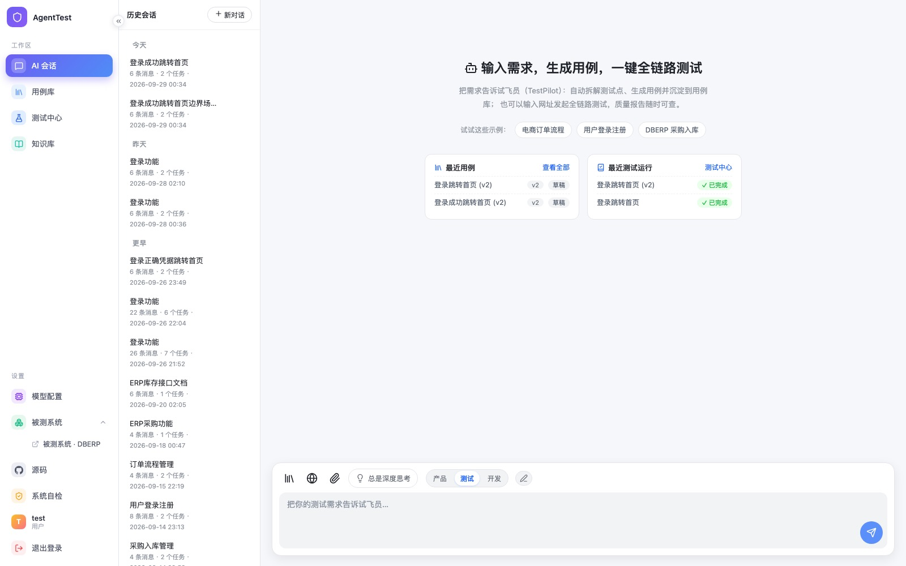
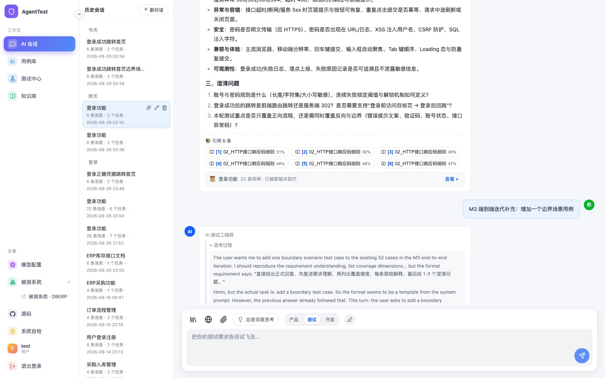
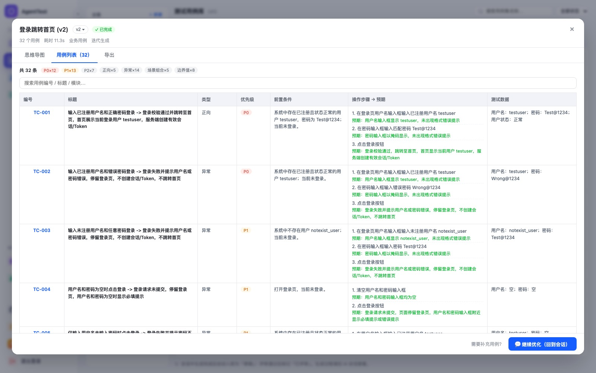

# AI 测试工作流平台（ai-testflow）

> 把"规格 → AI 生成测试用例 → 质量校验 → 导出"做成一条**可编排、可观测、可对话驱动的工作流**，并升级为**全链路自动化测试闭环**：给一个被测系统 URL，自动完成页面抓取 → 用例生成 → 脚本生成 → 执行 → 失败自愈 → 结构化报告。
> 内置 RAG 知识库与引用溯源、多厂商大模型模型池调度、多角色协作视角（产品/测试/开发）、用例库资产管理、平台自身质量看板。

在线演示：[https://ai.agentest.vip/](https://ai.agentest.vip/)

***

## 它解决什么

真实部署的 **DBERP 进销存系统**（服务器上已部署）没有 Swagger、也没有现成测试用例。
本平台以它为被测对象，把测试用例生成与自动化执行做成平台能力：

- 输入：接口规格（OpenAPI JSON）/ 业务需求（Markdown，支持图片引用）/ 知识库文档（PRD、历史用例、接口定义）/ 被测系统 URL
- 输出：结构化测试用例（xlsx / json / xmind）+ 可执行的 Playwright 自动化脚本 + 结构化执行报告
- 过程：四 Agent 编排，每步可观测、可重试、可定位错误；失败自动诊断自愈
- 扩展：用户级多模型池（多候选调度）、任务分类管理、思维导图在线评审、用例库资产管理、RAG 知识库问答



***

## 核心能力

### 1. AI 用例生成工作流

- **四 Agent 编排**：Parser → Generator → Reviewer → Exporter，任务状态机 + 步骤日志（每步状态 / 耗时 / 输出摘要 / 错误详情）
- **对话驱动**：主页会话输入框是发起工作的唯一入口——新任务、旧任务迭代都在对话中发起；迭代通过引用 chip 显式声明（先沟通、点「⚡ 生成用例」才真正生成），任务卡内联落在会话流中
- **多角色协作**：可选 产品 / 测试 / 开发 三种视角（可多选），角色化提示词模板 × 「测试点 × 角色」双层循环生成，跨角色合并去重
- **实时可观测**：生成节点实时显示子进度（第 N/M 个测试点 · 已生成 X 条）；步骤卡与总耗时实时计时；深度思考过程折叠展示
- **上下文输入**：支持上传 docx / pdf / md / xlsx 等附件注入对话；用例标题统一补齐为「动作 → 预期」复合形式
- **迭代与导入**：任务级迭代生成版本子任务（版本链可切换回看）；支持上传本地 xmind / xlsx / json 用例与生成结果合并去重
- **多格式导出**：XLSX（测试管理工具可导入）/ JSON（自动化框架可用）/ XMind（脑图评审）
- **任务调度底座**：全局任务队列 + 5 Worker 池，服务重启自动恢复未完成任务；失败任务断点续跑 + 一键重试

### 2. 全链路自动化测试（从 URL 到报告）

- **被测系统管理**：URL + 账号密码（Fernet 加密落库，API 永不回传），多 target 复用
- **页面抓取**：httpx + BeautifulSoup 同域 BFS ≤8 页；JS 渲染页自动降级 Playwright 渲染；支持账号密码登录（storage_state 复用，hidden 字段保留原值过 CSRF）；每页截图 + 探索过程录屏
- **六步工作流**：抓取页面 → 解析规格 → AI 生成用例 → 质量校验 → 生成脚本 → 导出文件；抓取完成后步骤卡就地展开页面卡片墙
- **脚本生成 Agent**：LLM 生成 Python Playwright 脚本（page fixture / get_by_role 选择器 / expect 断言约定），ast.parse 校验失败自动重试；conftest 模板由代码固化，不经 LLM
- **本机执行引擎**：独立执行队列 subprocess 跑 pytest + chromium headless；cwd 锁定 / 无 shell / 超时保护 / 环境变量白名单 / 凭据不落盘
- **执行报告**：pytest-json-report 结构化解析——汇总条 + 每用例 outcome / error / 截图；执行列表实时轮询、一键重试、截图 lightbox、录屏回放
- **自愈循环**：执行失败自动取证（报错全文 + 失败截图 + 源码 ast 提取）→ LLM 四分类诊断（脚本缺陷 / 产品缺陷 / 环境问题 / 选择器漂移，**硬约束禁止修改删除弱化断言**）→ 修复脚本（ast 校验 + 代码级断言保护）→ 备份后只重跑失败用例；前端展示自愈轮次与「疑似产品缺陷」警示区
- **探索式测试 Agent**：零文档发起，ReAct 自主导航/点击/填表/提交（ref 编号快照省 token），边探索边产出结构化用例；三重护栏——域名白名单锁定（越域拦截并回喂原因）、危险操作黑名单、步骤/时长预算收敛
- **探索治理**：视图指纹防重复（归一化 URL + tab 状态 + 元素集合 Jaccard 相似度，SPA tab 切换 URL 不变也能识别，连续无新视图自动收敛）；**计划先行**——探索前 AI 产出业务流程计划、前端逐步确认后执行；**实时画面**——勾选开关即以 3s 轮播观看 Agent 当前操作截图

### 3. RAG 知识库

- **文档入库**：docx / pdf / md / xlsx 等自动切分 + Embedding 向量化 → Chroma 向量库持久化；每库可设私有 / 共享
- **混合检索**：向量召回 + 关键词，相似度打分；检索测试台可验证命中来源与分值
- **多库联合检索**：对话中勾选多个知识库联合检索，不选库则不检索；无权限库静默剔除
- **引用溯源**：AI 回答自动附带「引用自《文档名》第 N 段」chips，点击跳转定位；引用随消息持久化，切换会话不丢
- **分块可干预**：文档分块可查看、编辑、修订回滚、重建索引；wiki 类型文档支持 AI 摘要与自动分类



### 4. 用例库资产管理

- 生成结果从会话任务卡沉淀为一级「用例库」页：左栏分类树即点即筛，右栏搜索 + 评审筛选
- **评审状态**：每条用例集可标记 草稿 / 已评审，行内一键切换
- **概览指标条**：全部 / 草稿 / 已评审 / 生成中 / 失败五张指标卡，点卡联动筛选
- 行内操作：重命名、归类、来源会话回跳、删除；窄屏自适应

### 5. 测试中心与质量看板

- **测试中心**独立一级页：全链路测试发起 + 执行报告 + 质量报告合并管理
- **平台自身质量量化**：pytest（525 条）+ Playwright e2e（5 套件）实测结果聚合成结构化数据，产品内可视化——测试为核心的平台，自己的质量拿得出数字
- 汇总指标卡 + 按测试文件的用例分布 + 历史趋势折线（近 30 次）；展示口径只含核心接口与 e2e，admin 可分段勾选运行范围
- 数据真实性红线：全部来自实测聚合 JSON，禁止写死展示值；运行失败显式 failed

### 6. 平台工程底座

- **多厂商大模型**：8 家厂商预设（百炼 / 魔搭 / 智谱 / 混元 / DeepSeek / Kimi / 豆包 / 自定义）+ Embedding 预设；LangChain 统一入口（`init_chat_model`，全 OpenAI 兼容协议一个 provider 打通）；深度思考参数透传与思考字段恢复补丁；LangSmith 可观测打点
- **多模型池调度**：文本 / 视觉 / 向量三槽独立，每槽多条候选按优先级调度——某条撞限流 / 额度用尽自动切换，任务不中断；健康状态（熔断冷却 / 成功失败计数）落库，重启不丢；个人池 > 平台池 > 环境变量 > mock
- **三级角色**：访客（共享账号，任务上限）/ 注册用户 / 管理员；数据隔离 + 越权统一 404 防枚举
- **分级流量加密**：admin 明文直通，user/guest 响应强制 AES-256-GCM 加密（密钥经 HKDF 派生，前端纯 JS 实现，HTTP 非安全上下文可用）
- **运行日志**：app.log 按小时切片 + error.log 单独成档；接口出入参访问日志（敏感字段自动脱敏、高频轮询降噪）
- **演示模式开关**：`AITF_ALLOW_DEMO=0`（默认）未配模型直接报错不静默 mock；`1` 时模板兜底开箱即跑



***

## 技术栈

| 层     | 选型                                               |
| ----- | ------------------------------------------------ |
| 后端    | **FastAPI**（自带 Swagger）                          |
| 数据库   | **MySQL**（生产）+ 本地 SQLite；SQLAlchemy 2.0 ORM 双方言适配 |
| 认证    | **bcrypt + JWT** + 每请求回查用户状态     |
| 加密    | **AES-256-GCM**（Python cryptography + 前端纯 JS 实现） |
| AI 模型 | **LangChain**（`init_chat_model` + 统一 `stream()`），8 家厂商预设 + 自定义 + 多角色协作模板；`AITF_LLM_BACKEND=httpx` 可回退旧直连 |
| 向量库   | **Chroma**（持久化于 `vectors/`）；Embedding 默认百炼 `text-embedding-v3`（可换任意 OpenAI 兼容端点） |
| 前端    | **React 18 + TypeScript + Vite**（zustand 状态管理），构建产物纯静态、FastAPI 同源托管 |
| 思维导图  | **MindElixir**（120KB，可编辑，原生标签支持）                 |
| 前端渲染  | **marked** + **DOMPurify**（XSS 净化）          |
| 文档解析  | **python-docx** + **pdfplumber**         |
| 页面抓取  | **httpx + BeautifulSoup**（同域 BFS）+ **Playwright** 渲染降级与登录态 |
| 自动化执行 | **Playwright(Python) + pytest**：脚本 LLM 生成（ast 校验重试），subprocess 隔离执行 + pytest-json-report 结构化报告（1 worker 队列） |
| 任务调度  | 全局任务队列 + 5 Worker 池（uvicorn 启动恢复未完成任务） |
| 测试    | pytest（525 条，覆盖认证 / 加密 / 权限 / 对话 / RAG / 知识库 / 迭代导入 / 附件解析 / 页面抓取 / 脚本生成与执行 / 自愈循环 / 探索式 Agent / 质量看板 / 模型池 / 日志等）+ Playwright 浏览器端到端套件（m1~m5 + 汇总 runner） |

***

## 快速开始

```bash
pip install -r requirements.txt
cp .env.example .env        # 可选：填 DASHSCOPE_API_KEY 接真模型；留空且不开演示模式则报错（见下）
python scripts/migrate_v2.py  # 首次/升级时执行（幂等）：建用户表 + 预置 admin + 存量数据迁移
python main.py              # 等价于 uvicorn main:app --port 8000
```

> **演示模式**：默认 `AITF_ALLOW_DEMO=0`，未配置模型直接报错（不静默 mock）。本地/现场演示想开箱即跑，在 `.env` 设 `AITF_ALLOW_DEMO=1`，未配模型时走模板兜底（明确标注 `used_mock`）。

数据库：`.env` 中配 `DATABASE_URL`；配 MySQL 则走 MySQL，留空默认本地 SQLite（双方言适配）。

前端（仅开发机需要 Node，服务器不装）：

```bash
cd frontend
npm install
npm run dev     # 开发热更新：http://localhost:5173（/api 代理到 8000，与生产同源架构一致）
npm run build   # 构建 → frontend/dist（不入库；线上发布走 scripts/deploy_frontend.sh 一键上传）
```

首次访问**无需注册**：可直接「游客体验」（共享 guest 账号），或注册账号（首个注册用户自动成为管理员）。

访问：

- 前端 Dashboard：<http://127.0.0.1:8000>
- 接口文档（Swagger）：<http://127.0.0.1:8000/docs>

***

## 演示流程（30 秒出成品）

1. 首页三选一：登录 / 注册 / 游客体验
2. 在会话输入框描述需求，或上传 DBERP 规格文件（`examples/` 下有现成样本）；可先多轮沟通再点「生成测试用例」（可勾选 产品/测试/开发 视角）
3. 选导出格式（xlsx / json / xmind），任务提交后在会话内实时看到四 Agent 进度
4. 点开任务看 **思维导图预览** / **测试用例表格** / **步骤时间线**
5. 需要补充用例：点任务卡或抽屉底部的「💬 继续优化」→ 沟通完点「⚡ 生成用例」→ 产出新版本，可在版本切换器里回看任一历史版本
6. 进「测试中心」对被测系统发起全链路测试：抓取 → 用例 → 脚本 → 执行 → 报告，失败自动自愈
7. **知识库问答**：新建库并上传 PRD / 历史用例 → 对话中勾选该库 → 提问，回答自动检索并附引用溯源

> 无模型 Key 时：开 `AITF_ALLOW_DEMO=1` 走 mock 兜底，无需联网即可演示完整编排流程。
> 配置真实模型：模型配置页选厂商 → 填 Key → 测试连通 → 保存（文本 / 视觉 / 向量三槽独立）。

***

## REST API

全部接口走 JWT 鉴权，交互式文档见 Swagger：`http://127.0.0.1:8000/docs`。

完整接口清单（含请求说明与业务规则）：**[docs/API.md](docs/API.md)**

***

## 关于用例生成核心库

本仓库已**内置** `generator_core/`（整合自 CLI 原型 `ai-testcase-generator` 的解析 / 生成 / 导出逻辑），
不再依赖外部项目，**clone 即跑**。平台层在其上叠加：任务调度状态机（全局队列 + Worker 池）、四 Agent 编排、
步骤可观测日志、REST API 与可视化前端。`generator_core/` 内部采用 mock 兜底（需 `AITF_ALLOW_DEMO=1` 才启用），无模型 Key 也能演示用例生成流程。

***

## 目录结构

```
ai-testflow/
├── main.py                      # 入口（挂载 API + 静态页 + 启动检查 + 调度器 + 任务队列恢复）
├── requirements.txt / .env.example
├── generator_core/              # 内置用例生成核心（parser / generator / reviewer / exporter + 角色提示词模板）
├── examples/                    # DBERP 接口规格 / 业务需求样本
├── app/                         # FastAPI 后端
│   ├── core/                    # 配置 / DB / 安全 / 加密 / 厂商预设 / 执行队列 / 加密中间件 / 日志配置 / 访问日志
│   ├── models/                  # SQLAlchemy 模型（Task/StepLog、User、Category、Knowledge、TestTarget/ExecutionRun、LLMModelPool）
│   ├── schemas/                 # Pydantic 请求/响应
│   ├── services/                # 业务服务（LLM 适配与池调度 / RAG 入库检索 / 文档解析 / 抓取 / 执行 Runner / 自愈 / 探索 Agent / 视图指纹）
│   ├── workflow/                # 状态机 + 引擎 + Agent 编排（parser/generator/reviewer/exporter/scripter 等）
│   └── api/                     # REST 路由（auth/guest/tasks/conversations/chat/knowledge/llm_pool/quality/automation/users/categories）
├── frontend/                    # React + TS + Vite 工程
│   ├── src/pages/               # Dashboard / CaseLibraryPage（用例库）/ E2EPage（测试中心）/ KnowledgePage / ModelConfigPage / AdminPage / SettingsPage
│   ├── src/components/          # chat（会话/步骤卡/实时画面/计划确认）/ task（执行面板/自愈/探索时间线）/ settings / admin / knowledge
│   └── scripts/                 # Playwright e2e 套件（m1~m5 + 汇总 runner + 功能目检脚本）
├── scripts/                     # 迁移 / 本地起服 / 前端发布 / 质量数据聚合
├── tests/                       # pytest 525 条 + 测试夹具
├── logs/ vectors/ uploads/ outputs/ quality_data/   # 运行时数据（gitignore）
└── docs/                        # 文档
    ├── PRD.md                   # 产品需求文档（含完整版本演进史）
    ├── API.md                   # REST API 完整清单
    ├── DEPLOY.md                # 部署指南（同源单服务 + 宝塔 Nginx 反代）
    ├── dberp-kb/                # DBERP 被测系统知识语料
    └── archive/                 # 历史过程文档归档（各版本执行方案）
```

***

## 部署架构

- **同源单服务**：FastAPI（127.0.0.1:8000）同时提供 API（`/api`）与前端静态资源（`frontend/dist`，相对路径调用，无跨域）；进程由宝塔 Python 项目管理器托管

- **服务器**：阿里云 ECS，宝塔面板统一运维（Nginx / MySQL / Python 项目）

- **公网访问**：宝塔 Nginx 反向代理，三域名全 HTTPS（证书 acme.sh 自动续期），域名已完成 **ICP 备案**：

  | 域名 | 用途 |
  | --- | --- |
  | `agentest.vip` | 个人主页（静态站，页脚挂 ICP 备案号） |
  | `ai.agentest.vip` | 本平台（Nginx 反代 → 127.0.0.1:8000） |
  | `erp.agentest.vip` | 被测系统 DBERP（PHP 站点） |

  IP 直连 80/443 已通过 `return 444` 断连，仅允许域名访问

- **前端发布**：`scripts/deploy_frontend.sh` 本地构建 → 打包上传 → 服务器解压重启 → 健康检查 + 外网验证（3 份滚动备份 + 失败自动回滚）；`frontend/dist` 不入库

- **后端同步**：git push 后服务器经 gh-proxy 镜像 `git pull --ff-only` 更新，宝塔面板重启项目生效

```
浏览器 ──HTTPS──> Nginx(443 · ai.agentest.vip) ──反代──> 阿里云:8000 (uvicorn)
                                                      ├── /api/*  REST API
                                                      ├── /health 健康检查
                                                      └── /       前端静态页(frontend/dist)
```

详见 `docs/DEPLOY.md`。

***

> **版本演进与后续规划**：完整版本史见 [docs/PRD.md](docs/PRD.md) 第 5 节；各版本执行方案归档于 [docs/archive/](docs/archive/)。
